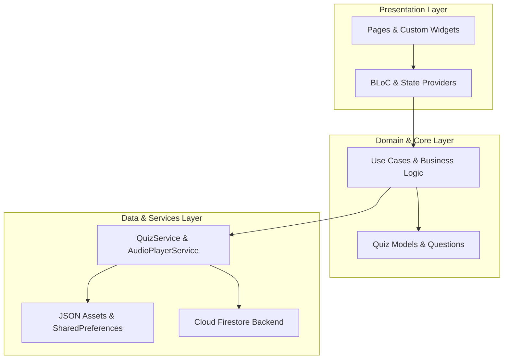
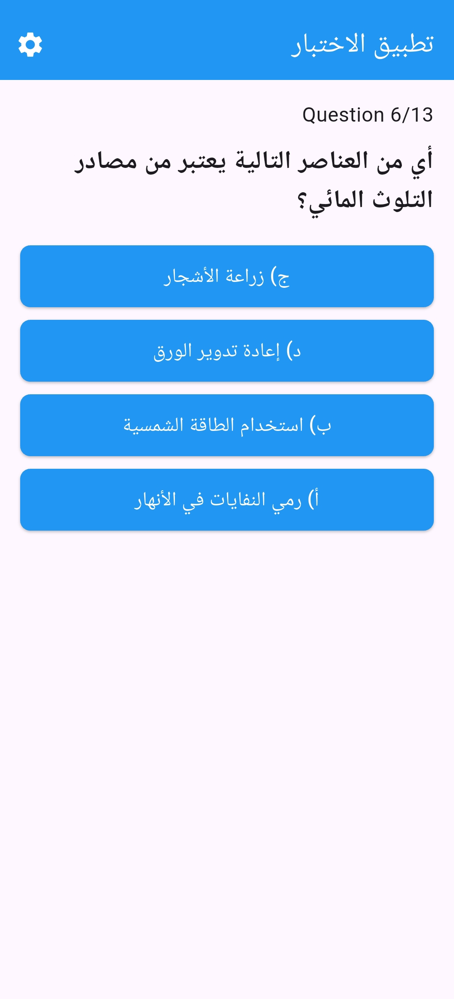
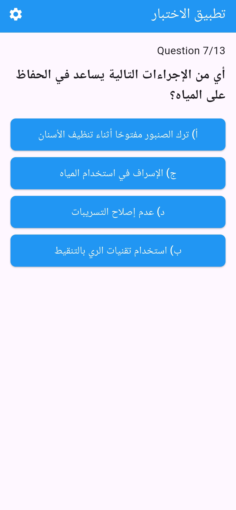
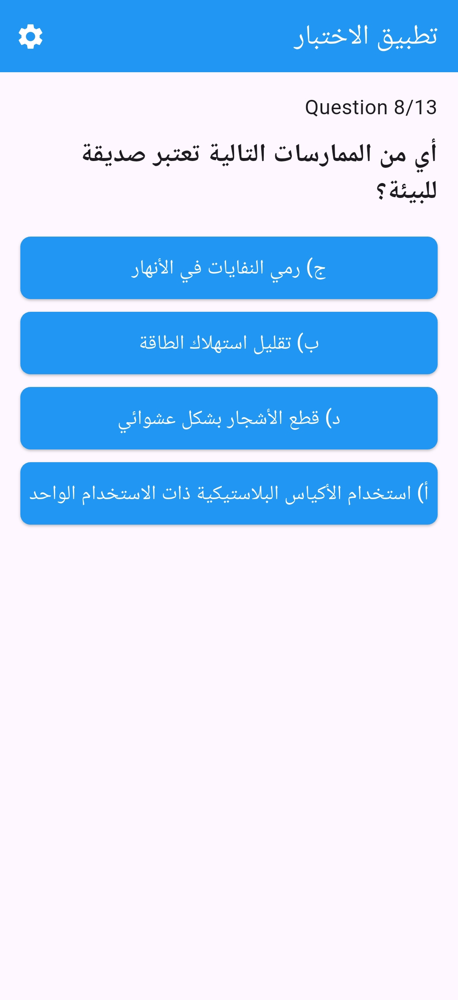
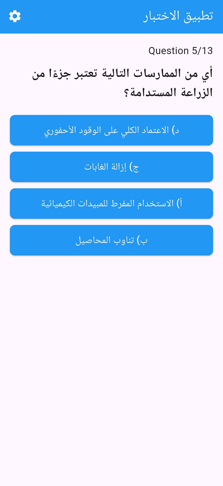

<div align="center">

# 📱 EcoQuiz: Environmental Sustainability Mobile Application

**Cross-Platform Interactive Quiz App Built with Flutter, Dart, Clean Architecture & BLoC State Management**

[](https://flutter.dev/)
[](https://dart.dev/)
[]()
[]()
[-2ECC71?style=for-the-badge)]()
[]()
[](LICENSE)

</div>

---

## 📌 Project Overview

**EcoQuiz** is a production-grade, cross-platform mobile educational application engineered to raise awareness regarding **environmental sustainability, renewable energy, and green computing practices**. Developed under **Pearson BTEC Higher National / Level 3 IT - Unit 07: Mobile Apps Development**, the application illustrates a complete mobile engineering lifecycle from initial UX wireframes to a modular, feature-first Clean Architecture in Flutter.

The project features dynamic question engines, auditory feedback mechanisms for correct/incorrect answers, bilingual localization (Arabic & English), responsive screen adaptation across mobile form-factors, and persistent state management.

---

## 🚀 Version Evolution (v1.0 ➔ v2.0)

| Feature / Capability | Initial Prototype (v1.0 & v1.1) | Production Release (v2.0) |
| :--- | :--- | :--- |
| **Software Architecture** | Single-folder monolithic UI layout | **Feature-First Clean Architecture** (`config/`, `core/`, `features/`, `l10n/`) |
| **State Management** | Basic `setState` triggers | **BLoC Pattern & Provider** for predictable, reactive UI updates |
| **Dependency Injection** | Manual class instantiation | **GetIt Service Locator** for loosely coupled component injection |
| **Localization** | Hardcoded Arabic text strings | **Full Internationalization (`intl` / ARB)** with real-time AR/EN switching |
| **Audio & Multimedia** | No audio integration | **Audio feedback engine** (`audioplayers`) playing correct/wrong sound cues |
| **Screen Responsiveness** | Fixed pixel dimensions | **Adaptive layouts** utilizing `flutter_screenutil` across all screen densities |
| **Theme Support** | Static light mode | **Dynamic Theme Provider** (Dark / Light theme toggles) |

---

## 🏛️ Clean Architecture & Software Design

The codebase in [`app/lib/`](app/lib/) strictly adheres to Clean Architecture principles separating responsibilities into distinct domain layers:



---

## 🎯 BTEC Unit 07 Learning Aims & Deliverables

| BTEC Assessment Aim | Engineering Focus Area | Project Deliverables |
| :--- | :--- | :--- |
| **Learning Aim B** | **Mobile App Design & UX Wireframing** | Comprehensive user journey maps, screen wireframes, navigation flowcharts, and color accessibility considerations documented in [`docs/Mobile_App_Design_Wireframes_Aim_B.docx`](docs/). |
| **Learning Aim C** | **Implementation & Verification** | Clean Flutter/Dart codebase with BLoC state management, dynamic quiz parsing, dependency injection, and bilingual support in [`docs/Mobile_App_Implementation_Testing_Aim_C.docx`](docs/). |
| **Aim B & C Evaluation** | **Review & Performance Optimization** | Empirical benchmarking of app responsiveness, memory usage, usability feedback, and code maintainability in [`docs/Mobile_App_Evaluation_Optimization_Aim_BCD.docx`](docs/). |

---

## 📸 Mobile UI Previews

<div align="center">

| Splash & Login Screen | Interactive Question Interface |
| :---: | :---: |
|  |  |

| Answer Feedback & Score | Settings & Localization |
| :---: | :---: |
|  |  |

</div>

---

## 📂 Complete Project Structure

```text
EcoQuiz-Flutter-Mobile-App/
├── app/                                       # Complete Flutter Mobile Application Codebase (this is v2)
│   ├── lib/                                   # Clean Architecture Source Code
│   │   ├── config/                            # App Routing & Theme Configurations
│   │   │   ├── routes/                        # Application Named Routes
│   │   │   └── themes/                        # ThemeProvider & Custom Palettes
│   │   ├── core/                              # Shared Core Utilities & Base Classes
│   │   │   ├── error/                         # Failure & Exception Handlers
│   │   │   ├── services/                      # GetIt Dependency Injection & Navigation
│   │   │   ├── utills/                        # App Constants, Colors, Strings & Assets
│   │   │   └── widgets/                       # Reusable Custom SVG & Network Image Widgets
│   │   ├── features/                          # Feature-First Modules
│   │   │   ├── home_screen/                   # Question Models, Quiz Service & Audio Service
│   │   │   ├── login/                         # Authentication UI, Custom TextFields & Forms
│   │   │   └── settings_screen/               # Language Switching & Preference Toggles
│   │   ├── l10n/                              # Bilingual ARB Internationalization (Arabic/English)
│   │   └── main.dart                          # Application Entry Point & Provider Setup
│   ├── assets/                                # Bundled Assets (Audio cues, Videos, JSON questions)
│   ├── android/                               # Native Android Manifest & Gradle Configuration
│   ├── ios/                                   # Native iOS Runner & Podfile Specifications
├── apk/                                       # Android Application Packages
│   └── v1.0.apk                               # Version 1.0 APK Release           (this is v1)               
├── assets/                                    # UI Screen Evidence & Captures
│   └── screenshots/                           # High-Resolution Photographic Proof
│       ├── v1/                                # Initial v1.0 & v1.1 Prototype Screens (12 captures)
│       └── v2/                                # Production v2.0 Responsive Screens (14 captures)
├── docs/                                      # BTEC Unit 07 Formal Documentation & Reports
│   ├── BTEC_Unit07_Mobile_Apps_Brief.pdf      # Official Pearson Assignment Brief
│   ├── Mobile_App_Design_Wireframes_Aim_B.docx # Wireframing, UX Journey & Flowcharts (Aim B)
│   ├── Mobile_App_Implementation_Testing_Aim_C.docx # Implementation, Architecture & Testing (Aim C)
│   └── Mobile_App_Evaluation_Optimization_Aim_BCD.docx # Comprehensive Review & Evaluation (Aim BC)
├── .gitignore                                 # Flutter, Dart, Gradle & OS Exclusions
├── LICENSE                                    # MIT License
└── README.md                                  # Production-Grade Repository Documentation
```

---

## 🚀 Installation & Running the App

### Prerequisites
- **Flutter SDK** (v3.19.0 or higher) & **Dart SDK** (v3.3.0+).
- Android Studio / VS Code with Flutter extension.
- Android Emulator or connected physical device.

### Quickstart Commands
```bash
# 1. Clone the repository
git clone https://github.com/your-username/ecoquiz-flutter-mobile-app.git
cd ecoquiz-flutter-mobile-app/app

# 2. Ensure Flutter environment is clean and updated
flutter channel stable
flutter upgrade
flutter pub get

# 3. Launch the application
flutter run
```

---

## 📄 License

This project is open-source and licensed under the [MIT License](LICENSE).

---

## 👨‍💻 Author

Developed by **Mamoun Sraiheen**  
*Passionate Mobile Software Engineer, Full-Stack & Computer Science Student*
